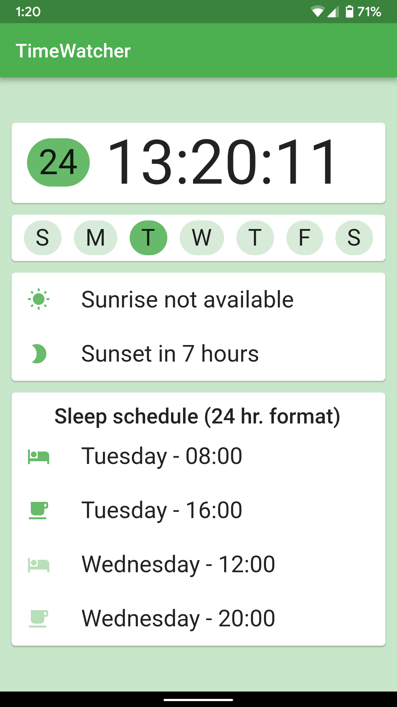

# TimeWatcher

A 28 hr. day companion.

| 28 hr. mode                                | 24 hr. mode                                |
| ------------------------------------------ | ------------------------------------------ |
|  |  |

## Motivation

For a long time, society has been using the 7 day week format, and it's been great, but not for everyone.

A lot of us go to sleep late at night and spend the day being very tired. What if you could be productive for 4 more hours a day and still get 8 hours of sleep? 


Here is where __TimeWatcher__ comes in.

## Description

By dividing the week in 6 days, we get exactly 28 hours a day.

``` 
24 * 7 = 24 * 6 + 24 = 24 * 6 + 4 * 6 = (24 + 4) * 6 = 28 * 6
```
The week starts on Sunday at 00:00 and the app provides you with an easy way of jumping in and out of the 28 hour mode. Just align your sleep schedule at the start of the week and make a switch. You can switch back at the end of it.

Users following the 28 hour format will find out that the sun cycle doesn't match the sleep schedule anymore.

Our app provides a clean and easy way to get information related to the sun cycle, sleep cycle and the day of the current week. Just tap to switch. __It's that easy.__

## Compatibility

This app was developed and tested for an Android platform (Android Pie), but should be compatible with iOS.

Hardware tested on: Google Pixel 2, Nokia 8

__Size:__

```
Catalins-MacBook-Pro:lib catalinboiangiu$ find . -name "*.dart" | xargs cat | wc -c
    5117
```

## References

- [xkcd - 28-Hour Day](https://xkcd.com/320/)
 
